<div align="center">

# 🗺️ PenNodePaper

**Build your pen & paper world and story on an infinite canvas, with an AI co-GM that works right in front of you.**


<br>

<a href="https://github.com/Rec0iL/PenNodePaper/commits/main"></a>
<a href="https://github.com/Rec0iL/PenNodePaper/stargazers"></a>
<a href="https://github.com/Rec0iL/PenNodePaper/issues"></a>


<br><br>

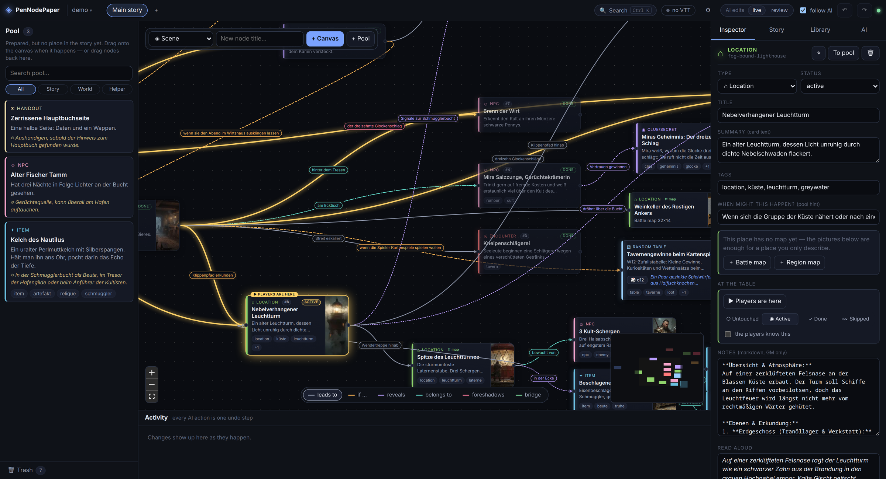

<sub>A small example campaign (written in German). Everything you see is a plain file in a folder.</sub>

</div>

AI-assisted world & story building for pen & paper. An infinite node canvas for the story, a sidebar **pool** for prepared nodes that don't have a fixed place yet (the tavern the players may or may not visit), and an AI co-GM (Claude or agy) that edits the campaign through an MCP server — every change animated live.

## ✨ Highlights

* 🧩 **Node canvas + pool** — scenes, NPCs, places, clues, items and more as typed nodes with typed connections; prepared material waits in the pool until it is needed.
* 🤖 **AI co-GM** — Claude or agy edit the campaign through MCP and you watch every change happen; each request is one undo step, or review it first.
* 📚 **Rulebooks & world books** — the AI looks rules up instead of inventing them.
* 🎨 **Images & maps** — portraits, scenes and handouts via your local ComfyUI; battle and region maps you or the AI edit, painted on request.
* 🔌 **Live VTT bridge** — push handouts, scenes, NPCs and music to KINETIK VTT (or any VTT that speaks the small bridge protocol), or export a file.
* 🎭 **Running the session** — split the party, track where each group is, get back on track, share a spoiler-safe wiki with your players.
* 📘 **GM binder** — the whole campaign as one printable A4 PDF with page references on every connection.
* 🛟 **Yours to keep** — backups, branching campaigns, optional git; everything is markdown and JSON on your disk.

## 🧭 The canvas

The story lives on an infinite canvas; the **pool** on the left holds everything that has no place in the story yet. **Semantic zoom** keeps big campaigns readable: far zoomed out, cards shrink to their type colour and one big title; zoom in and the full cards come back, with summary, tags, status and thumbnail.

<div align="center">
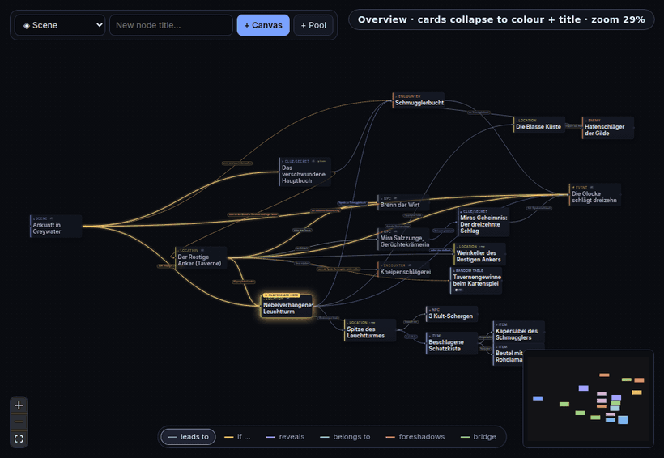
</div>

<table>
  <tr>
    <td width="50%">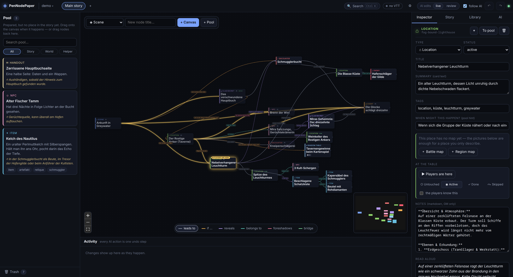<br><sub><b>Overview</b> — see the whole story at a glance.</sub></td>
    <td width="50%"><br><sub><b>Detail</b> — full cards, status badges and pictures.</sub></td>
  </tr>
</table>

Connections have kinds (leads to, if …, reveals, belongs to, foreshadows, bridge), each with its own colour that you can switch on and off from the bar at the bottom.

## 🚀 Install & run

```bash
npm install
npm run dev          # server :4317 + web UI :5273  -> open http://localhost:5273
npm run build && npm start   # production: server serves the built UI on :4317
```

First launch seeds a small demo campaign in `campaigns/demo/`. The server starts with the campaign you used last; switch, create or branch campaigns from the campaign menu in the top bar (or force one with `PNP_CAMPAIGN=<folder>`).

**What you need:** Node 20+. Optional, each unlocks one feature: the `claude` and/or `agy` CLI (AI chat), a local **ComfyUI** with Krea 2 (images, painted maps), **WeasyPrint** (`pip install weasyprint`, GM binder PDF), **ImageMagick** (image thumbnails), `unzip` + `pdftotext` (importing .docx / .pdf notes), `git` (optional local git commits).

> 📖 **Step-by-step guides for Linux, macOS and Windows** (including every optional tool, the AI CLIs, ComfyUI and troubleshooting): **[docs/INSTALL.md](docs/INSTALL.md)**

## 🤖 The AI


<div align="center">
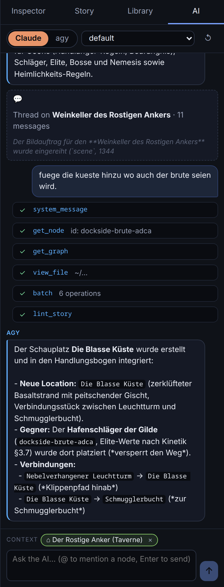
</div>

**Watch it work.** `npm run ai-demo -w @pnp/server` plays a short scripted AI session against the demo campaign, using the very same MCP calls Claude or agy make: a card flies out of the pool onto the canvas, a connection draws itself, a new NPC spawns with a glow, an edit flashes, a connection slides to a new target, a node is deleted, and another one returns to the pool. Every step lands in the activity log and is one undo step.

<div align="center">
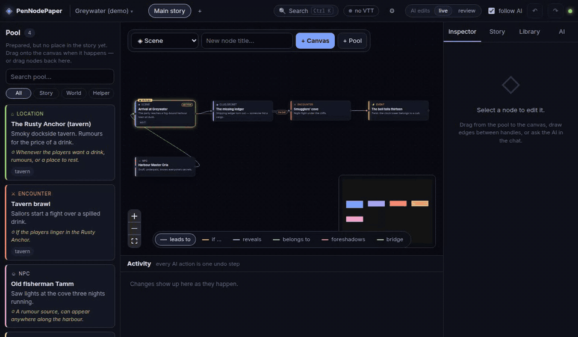
</div>

* **In-app chat** (right dock → *AI*): switch Claude / agy per conversation, pick a model, `@`-mention nodes, selected node is sent as context. Per-node threads live in the inspector and leave a pointer card in the global chat.
* **Claude** works out of the box (the app spawns `claude -p` headless and hands it this app's MCP server; only the campaign tools are allowed).
* **agy** needs a one-time *Connect agy* click in the chat (runs `agy mcp add …`, which registers the server in agy's own global config).
* **External clients** (Claude Code in a terminal, etc.) can attach to `http://127.0.0.1:4317/mcp` with the bearer token from `~/.config/pennodepaper/config.json`:

  ```bash
  claude mcp add --transport http pennodepaper "http://127.0.0.1:4317/mcp?actor=claude" --header "Authorization: Bearer <token>"
  ```

Every MCP call is one undo step (`Ctrl+Z` / `Ctrl+Shift+Z`). Deleting is a soft delete (Trash in the pool panel).

## 📚 Library: rulebooks & world books

Two kinds of stable reference documents live in the **Library** tab (not on the canvas), both plain markdown split by headings, both searchable by you and the AI:

* **Rulebooks** — load your system's rules (upload or import by path). The AI uses `search_rules` / `get_section` / `list_chapters` instead of inventing mechanics, and an optional *core rules digest* is always in its context.
* **World books** — lore, geography, history, factions; as much text as you like. A small autosaving editor (**Library → ＋ New / Edit**) has an outline, formatting shortcuts and a summary field. The AI always sees each book's dense summary + a compact outline, searches the rest with `search_world` / `get_world_section`, and can write or extend a book on request (`write_world`, previous version backed up in `worldbooks/.bak/`).

## 🎨 Images (ComfyUI)


<div align="center">
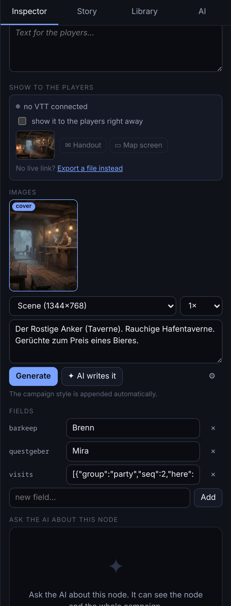
</div>

Per node: **Inspector → Images**. Pick a kind (portrait / scene / item / handout / banner), write a prompt or let the AI write it (**✦ AI writes it**), generate 1–4 variants, choose the cover, click for the lightbox. Jobs run one at a time with live progress; finished images attach to the node as undoable edits. Settings (⚙): ComfyUI URL + model pickers (defaults = your KINETIK Krea 2 Turbo setup), campaign image style, campaign language. The AI can do all of it through `generate_image`, `image_queue`, `set_cover_image`, `remove_image`.

## 🗺️ Maps


<table>
  <tr>
    <td width="50%">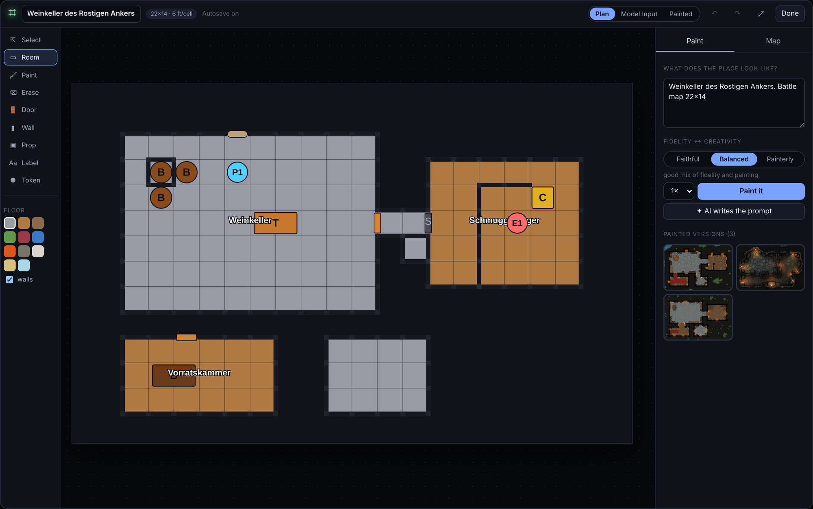<br><sub><b>Plan</b> — the editor you and the AI share.</sub></td>
    <td width="50%">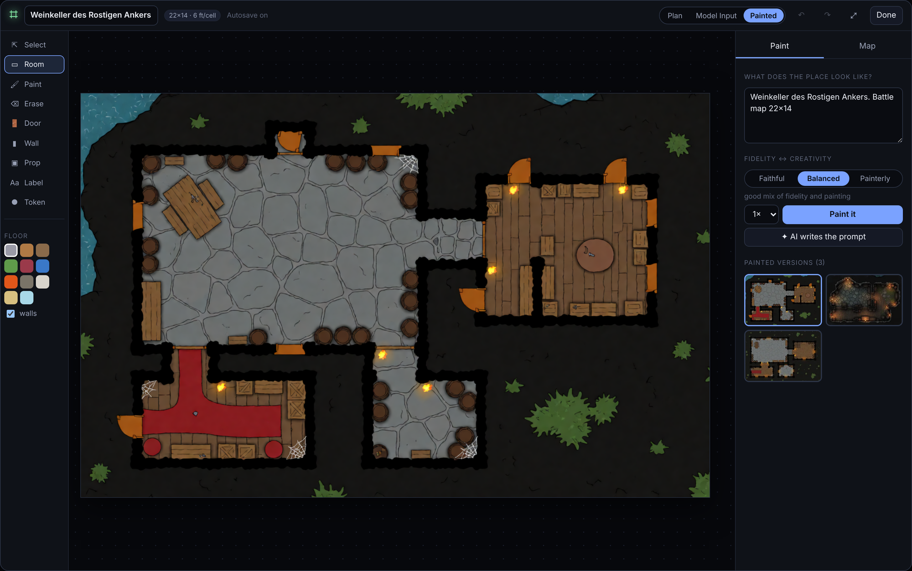<br><sub><b>Painted</b> — the same plan, painted by ComfyUI.</sub></td>
  </tr>
</table>

Two kinds, both stored as plain JSON in `maps/` and attached to a **location** (double-click the location's card, or Inspector → *Open the map of this place*):

* **Battle maps** — a grid floor plan: rows of text, one character per cell (stone, wood, water, …), doors/props/labels/tokens; **walls are derived** from the floor, so you never draw them. 1 cell = 6 ft by default.
* **Region maps** — colour-coded vector shapes (sea, forest, mountains, roads, towns) with a freehand *Scribble* brush.

The **Select** tool (first in the toolbar) edits what is already drawn: click a prop, token, label or door — or drag a box over cells — then drag to move it (Alt = copy), nudge with the arrow keys, rotate props with R, duplicate with Ctrl+D, delete with Delete, and change kind/size/name in the panel; a selected box can be moved with everything on it, filled with another floor or deleted. On region maps it moves, recolours and renames shapes. The AI has the same moves (`move_area`, `edit_prop`, `edit_token`, `edit_label`).

The editor autosaves and edits through the same ops as the AI's `edit_map`, so you and Claude/agy can work on one map at once (AI changes glow briefly). **Paint** turns the plan into a painted map via ComfyUI img2img (Krea 2): *Faithful* keeps your plan exactly, *Painterly* is richer but may drift. *Model input* shows exactly what the image model receives.

## 🔌 VTT link

Connect a tabletop app (KINETIK VTT, or any VTT that implements the small bridge protocol — see `docs/vtt-bridge-spec.md`; vanilla-JS VTTs can drop in `docs/pnp-bridge-client.js`) and push **handouts, scenes (map + grid + token starts), enemies/NPCs** and **music cues** from the Inspector or via the AI (`push_handout`, `push_scene`, `push_character`, `play_track`, `list_vtt_tracks`).

### Supported VTTs

✅ supported · ❌ not supported (yet)

| | 🥋 **[KINETIK VTT](https://github.com/Rec0iL/KINETIK-PNP)** | 🏴‍☠️ **[EldaraHQ](https://github.com/DonDavis-vibe/EldaraHQ)**<br><sub>Extended How to be a Hero</sub> | 🦸 **[HeroHQ](https://github.com/DonDavis-vibe/how-to-be-a-hero-character-sheet)**<br><sub>How to be a Hero</sub> |
|---|:---:|:---:|:---:|
| 📜 Handouts: text | ✅ | ✅ | ✅ |
| 🖼️ Handouts: picture | ✅ | ✅ | ✅ |
| 👁️ Show a handout to the players right away | ✅ | ✅ | ✅ |
| 🗺️ Maps & scenes (square grid, token starts) | ✅ | ✅ | ❌ |
| 🧙 NPC entries | ✅ | ✅ | ✅ |
| 🎭 NPC portrait, used as the map token | ✅ | ✅ | ❌ |
| 👹 Enemy stat blocks (tiers goon → nemesis, moves) | ✅ | ❌ | ❌ |
| ⚔️ Enemies in the combat tracker | ✅ | ✅ | ❌ |
| 🎵 Music cues (tracks and moods) | ✅ | ✅ | ✅ |
| 👥 Party sync (the players' characters, read-only) | ✅ | ✅ | ✅ |

What an NPC entry holds depends on the game:

* **KINETIK VTT** — name, note and token size; enemies get full stat blocks with the tier ladder, level, bonus, protection, willpower, energy and moves.
* **EldaraHQ** and **HeroHQ** — the GM's NPC list: place, role, attitude, what stands out, motivation and kind of being. *How to be a Hero* has no enemy stat blocks, so enemies are NPC entries too. In EldaraHQ an NPC also gets a map token size, and with hit points and a side it joins the combat tracker; HeroHQ stores no portrait.

Each VTT ships its own small bridge client, and PenNodePaper learns what it can do from the capability profile it announces on connect (the real ones for EldaraHQ and HeroHQ are in [`docs/profiles/`](docs/profiles)). The AI only offers what the connected VTT supports and writes characters in that game's own terms. No live link? **⚙ Settings → VTT link → export a file** works with the cached profile (a KINETIK session file today).

> Building or adapting a VTT? The protocol is small and versioned: [`docs/vtt-bridge-spec.md`](docs/vtt-bridge-spec.md), with a drop-in vanilla-JS client and a mock VTT for testing.


**Locations carry their map.** A map is an attachment of a location (there is no separate map node): *Inspector → ＋ Battle/Region map*, or `create_map` with `nodeId`. In *Show to the players* every picture attached to any node (an NPC portrait, an item, a place) can go out as a **handout**, and for places also onto the **map screen** as a backdrop (no grid, no tokens) — or you push the location's **battle map** (grid + tokens) instead; you choose which one the players see first. Smaller areas inside a place (the cellar under the tavern) are their own locations linked with *belongs to*. Older campaigns' map nodes load as locations.

**Enemy and NPC nodes adapt to the game system:** the VTT describes how characters are structured in its ruleset (fields, ranges, presets); PenNodePaper builds the sheet form from that, validates it, and briefs the AI (`get_vtt_capabilities`, `set_character_sheet`) — so the AI can write sheets in the game's own terms. A VTT may *describe* characters without being able to *receive* them yet; the cached structure also works offline. The VTT announces its capabilities on connect; PenNodePaper caches them so exports work offline. Offline: ⚙ Settings → *VTT link* → export a **KINETIK session file** or a universal **UPF** bundle. The KINETIK file is a complete new session: maps as scenes (with their tokens), a picture of each place as a grid-less backdrop scene, handouts, enemies in the combat list (with portrait), and NPCs as map tokens with portrait and note — on the scene of the place they *belong to*, else on the first scene. Load it on the VTT's GM start screen (it replaces that VTT's session).

**Your players' characters come along:** a VTT that reports its party (`provides.party`) fills the **Party strip** above the pool with the players' characters when a session is open — portrait, player, online state; they are saved as `pc` nodes in the campaign folder (so they are there offline, and resync when the players change them; players who leave are kept, marked absent). The VTT owns the sheet (read-only here); your notes and the party group are yours.

## 🎭 Running the session


<table>
  <tr>
    <td width="33%">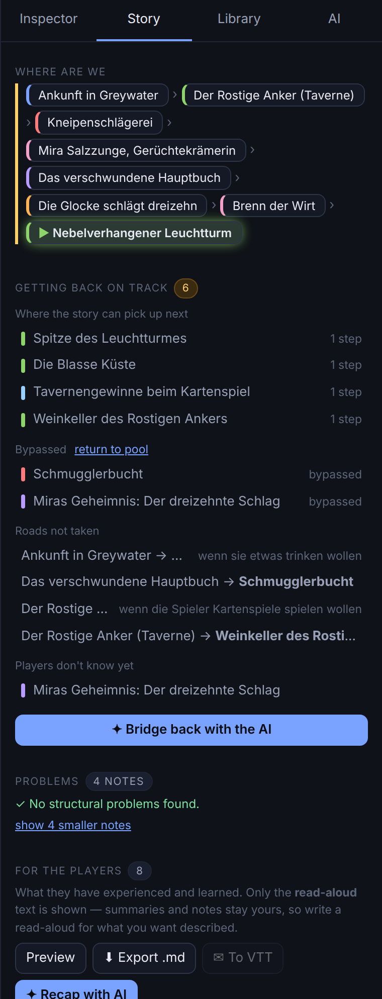</td>
    <td width="67%">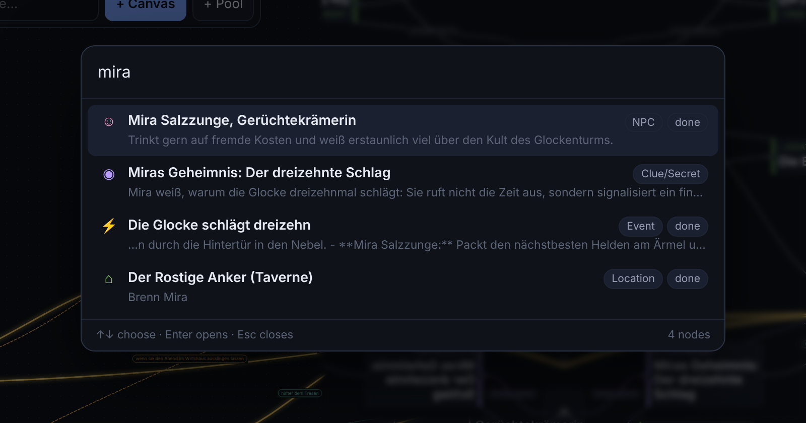<br>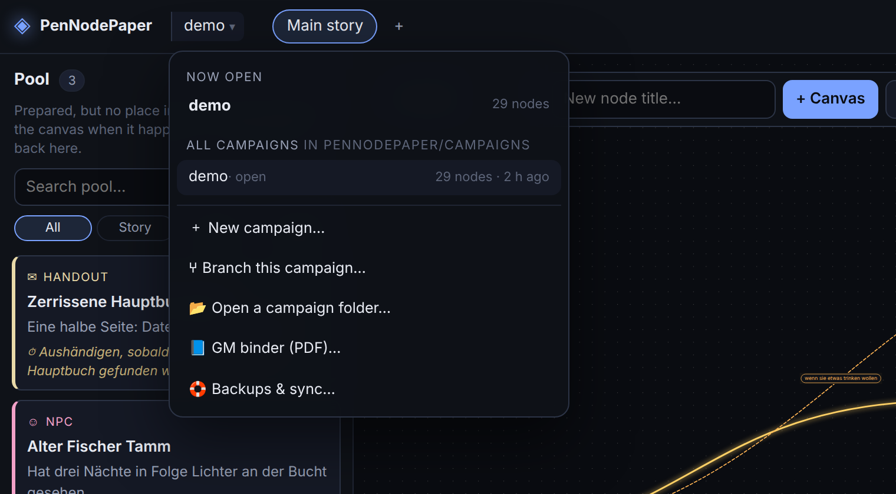</td>
  </tr>
</table>
<sub>The <b>Story</b> tab (left), search with <kbd>Ctrl</kbd>+<kbd>K</kbd> and the campaign menu (right).</sub>

* **Right-click a node** → *Move players here*: tick which players go there (or pick *Whole party* / a group). The party can split up — each part keeps its own coloured marker and trail, groups are named after who is together (“Anna & Ben”), and when they meet again they become the plain “party”. Select **several nodes** (Shift-click or Shift-drag, or Ctrl/Cmd-click) to mark the players as being at all of them at once — e.g. in the tavern while the bell is ringing — or to set all their statuses together. The same menu sets the **status** (untouched / active / done / skipped; *active* is a marker only — several nodes can be active — and doesn't move anyone). Right-click a **connection** to take the played-path highlight off it (the players went back and forth), change its kind or reverse it; right-click the **empty canvas** to add a node right there.
* **Campaigns** — the campaign name in the top bar is a menu: open another campaign, create a new one, jump back to a recently used one, or open any campaign folder by path. (Switching waits until the AI and image queue are idle; the VTT reconnects by itself.) The server starts with the campaign you used last.
* **Import notes** (Library tab) — bring in your existing prep as .md, .txt, .docx, .pdf or pasted text. The text is kept in the campaign's `imports/` folder; one button lets the AI read it in chunks (`list_imports`, `read_import`) and create typed nodes — places, NPCs, items and clues go to the pool, an ordered run of scenes onto the canvas, linked by kind. It never invents facts and tells you what was unclear.
* **Backups & sync** (campaign menu → *Backups & sync…*) — snapshots of the whole campaign folder as `.tar.gz` in `snapshots/`: automatic ones while you work (only when something changed, light = no images, the oldest are pruned; leaving a campaign also saves it), manual ones with a label (with images), and a *before restore* safety snapshot every time you restore. Restoring puts nodes, graph, maps and books back. Every snapshot can also be copied to a **mirror folder** (Dropbox / Syncthing / USB), the whole campaign can be exported as **one file** and opened on another machine, and an optional **local git** repo gets a commit per snapshot (pushing is yours to do — nothing is ever sent anywhere by itself). The AI can take a safety snapshot before risky bulk edits (`create_snapshot`) but cannot restore.
* **Random tables** — a *Random table* node holds one entry per line (`3× Fog` = three times as likely; the die is the number of faces: 6 entries = d6). 🎲 on the card (or right-click → Roll) rolls it, the last result stays on the card and a short history in the Inspector. **✦ Fill with AI** writes entries from your world books (names, rumours, loot, weather, complications). The AI can fill and roll tables itself (`set_table`, `roll_table`).
* **GM binder** (campaign menu → *GM binder (PDF)…*) — the whole campaign as one printable A4 PDF made with WeasyPrint: cover, contents with page numbers, the story map as a picture, the story beat by beat in reading order (read-aloud in a shaded box, your GM notes, where each beat leads — every connection also names the chapter and page of its target, so it works on paper too), prepared material, places with their maps, people with character sheets, things and secrets, handouts (one per page), random tables and the party. Choose the sections, leave out your GM notes (for a co-GM), or drop the pictures for a small file. The AI can make it too (`export_binder`). Needs `weasyprint` (`pip install weasyprint`).
* **Search** (Ctrl/Cmd+K, or the 🔍 in the top bar) — jump to any node by what you remember of it: words in the title, tags, summary, read-aloud, notes or fields (accents are ignored; every word must match). Filters: `type:npc`, `#tag`, `is:pool` / `canvas` / `played` / `unplayed` / `known` / `active`. Enter opens it (centres it on the canvas, or scrolls to it in the pool). Start with `>` for actions (new node, tabs, backups, binder, undo…).
* **Frames** — group nodes into labelled coloured areas (an act, a district): right-click the empty canvas → *Frame*, or select several nodes → right-click → *Frame these nodes*. Drag a frame by its title to move it **with everything inside**; resize it by its corners, double-click the title to rename, right-click for colour and removal. Frames show in the GM binder's story map too. The AI draws them with `create_frame` (and `move_frame`, `update_frame`, `delete_frame`) to tidy a big canvas.
* **Image thumbnails** — cards, tiles and avatars load small cached copies (`images/.thumbs/`, made once with ImageMagick, left out of snapshots and git); the lightbox, map editor and PDFs use the originals. Without ImageMagick the originals are used.
* **Review mode** (top bar: *AI edits* live / review) — in **live** mode the AI's edits stand until you undo them. In **review** mode they still appear at once (so the AI can build step by step), but each chat request becomes one change set that waits in a review bar on the canvas: new and changed nodes carry a dashed ✦ mark, new links are dashed. **Keep** accepts it, **Reject** takes exactly that set back (it refuses if you edited the same things afterwards, so nothing of yours is overwritten). Pending sets live in memory: restarting the server counts them as kept. Side effects outside the canvas (image jobs, VTT pushes) are not held back.
* **Branching** (campaign menu → *Branch this campaign…*) — a full copy of the open campaign (images included) under a new name, opened right away, for trying another storyline (“what if the players side with the cult?”). The original stays untouched and is one click away in the list; the copy remembers which campaign it branched from.
* **Zooming out** — far zoomed out, cards shrink to the type colour and one big title (and frame titles grow), so a large campaign stays readable at a glance; zoom in and the full cards come back.
* **Layout** — drag the splitters between the pool, the canvas, the side panel and the activity strip to resize them (double-click a splitter to reset it; sizes are remembered).
* **Story tab** — where each group is, how and where they can get back on track (meeting points, what was skipped or not yet revealed), the story linter, and progress clocks.
* **For the players** (Story tab) — a spoiler-safe wiki of what the players have experienced and learned: the story so far in play order (marked by group when the party split), the people, places and things they met, the clues they know. It uses only the **read-aloud** text (summaries and notes stay yours). Preview it, export it as markdown, send it to the VTT as a handout, or have the AI write a narrator-style recap from it (`player_wiki`, `export_player_wiki`, `push_player_wiki`). Tick *the players know this* on an NPC, place or item to list it without having visited it.
* **Image queue** — a chip in the top bar shows what is generating and what waits (click for the list); cards show ⏳ queued / ◌ percent; the Generate button turns into *Add to queue* while something runs.
* **Connection kinds** — hover a kind in the bar at the bottom for what it is for (leads to, if …, reveals, belongs to, foreshadows, bridge).
* The AI has the same tools: `move_players`, `set_status`, `mark_played`, `set_known`, `advance_clock`, `story_status`, `lint_story`, `get_party`, `sync_party`.

### 📘 The GM binder

<div align="center">
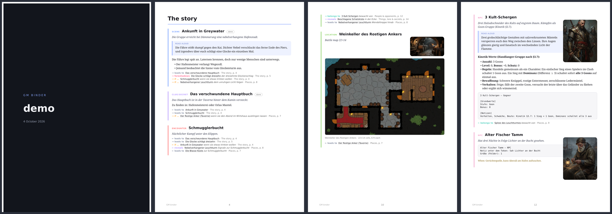
</div>

## 📁 Campaign folder

```
campaigns/<name>/
  campaign.json     name, language, image style, backup settings, AI mode (live / review)
  graph.json        canvases, frames, placements (node -> x/y; no entry = in the pool), edges
  nodes/<id>.md     YAML frontmatter + markdown body; `<!-- read-aloud -->` splits off the player text
  maps/*.json       map documents (+ .history/)
  vtts/*.vtt.json   cached VTT capability profiles
  rulebooks/*.md    + _digest.md (core rules digest)
  worldbooks/*.md   + _summaries.json, .bak/ (autosave history)
  imports/*.txt     notes waiting to be turned into nodes
  images/           generated art + index.json (prompt/seed per image); .thumbs/ is a cache
  snapshots/        backups (.tar.gz) — not part of a snapshot or of git
  exports/          PDFs, VTT bundles, player wiki, campaign archives — likewise
  chat.json
```

Plain files: git-friendly and hand-editable — external edits (including Claude Code editing the folder directly) show up live in the UI.

## 🧪 Dev scripts

```bash
npm run smoke   -w @pnp/server   # drive a running server through the real MCP client
npm run ai-demo -w @pnp/server   # paced fake-AI session to watch the animations
npm test                          # command layer / undo / persistence tests
```

## 🧱 Layout

* `packages/shared` — domain types, node/edge metadata, WebSocket protocol
* `packages/server` — store + transaction/undo layer (`store.ts`), command registry used by both REST and MCP (`commands.ts`), MCP endpoint, CLI chat runner, file watcher
* `packages/web` — Svelte 5 + Svelte Flow UI; `lib/app.svelte.ts` is the animation director

Design decisions and the original plan: `docs/design-plan.md` (with a status list at the top). The VTT side is documented in `docs/vtt-bridge-spec.md`.
